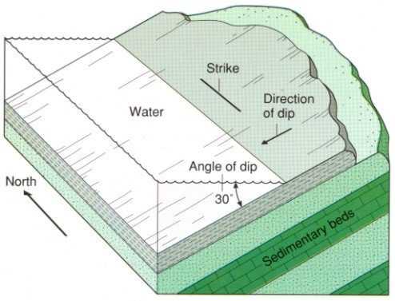
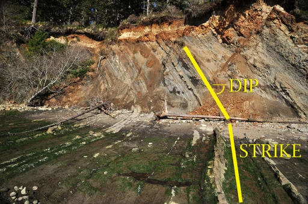

# ClarBruntonConverter
Conversor de atitudes geológicas (Geological Compass Attitude Converter) - Criado por Guilherme Vieira

O mais importante neste projeto é o código javascript criado para a conversão de atitudes planares. Atualmente, este projeto conta com um site e metas que serão sumariamente cumpridas a medida que o criador se especialize em novas ferramentas de desenvolvedor.

## Conceito
Para entender o conceito de atitudes planares é bastante interessante visualizar o que seriam os planos e como eles são medidos. Por conta disso, deixarei esta imagem abaixo para que acompanhe a explicação:

Imagem retirada [daqui](https://www.quora.com/How-can-I-visualize-the-strike-dip-amount-and-dip-direction-practically/answer/Darcy-Cordell)

Sempre utilizaremos o Norte (North) e o plano horizontal, que na imagem é representada pela água, como referências.

Na medida tomada via bússola Brunton usamos o Strike do plano (interseção com o plano horizontal) e o ângulo de mergulho (na imagem é o "Angle of dip"). Além disso, devemos indicar para qual lado o plano está se dirigindo, pois a interseção do plano a ser medido e a horizontal tem duas possibilidades de mergulho (dip direction).

Também é importante notar que na medida brunton apenas se utiliza o 1º e o 4º quadrante do diagrama polar da bússola, seja em rumo ou Azimute. Ou seja, a medida do Strike estará sempre entre 360°(ou 0°) e 90° ou 270° e 360°(ou 0°). Esta é uma conveção que facilitam os estudos entre os especialistas.

Na medida tomada pela bússola Clar apenas se utiliza a linha paralela ao mergulho do plano (Dip Direction) e o quanto está mergulhando, sempre em relação as referências (Norte e o plano horizontal).

Aqui é possível visualizar em campo como são tomadas essas medidas:

Imagem retirada [daqui](https://fractalplanet.wordpress.com/2014/03/15/understanding-strike-and-dip-on-geologic-maps/) 

## Como usar?
Já é possível fazer a conversão via WEB por [AQUI](https://gui-nvieira.github.io/ClarBruntonConverter/). Basta entrar com os valores da atitude a ser covnertida no site.

## Próximos updates:
- ~~Interface web com HTML/CSS com SASS, Bootstrap e Node;~~ (30/09/2022)
- ~~Retoques finais e Publicação da página pelo GitHub Pages.~~ (03/10/2022)
- ~~Melhorias para inserir direção de mergulho no formato Brunton, utilizando arrays ou objetos.~~ (03/10/2022)
- ~~Inserção do site no Google Search Console.~~ (05/10/2022)
- Conversão de atitudes rumo para azimute (e vice-versa).

## Metas:
- Web app com suporte a utilização offline (Via React Native)

## Referências
O [material de referência](https://edisciplinas.usp.br/pluginfile.php/5178772/mod_resource/content/1/Aula-B%C3%BAssolas%20-%20CRP.pdf) consultado sobre os sistemas de atitudes e bússolas foi produzido pela a Profa. Dra. Cláudia R. Passarelli, da Geologia-USP.
